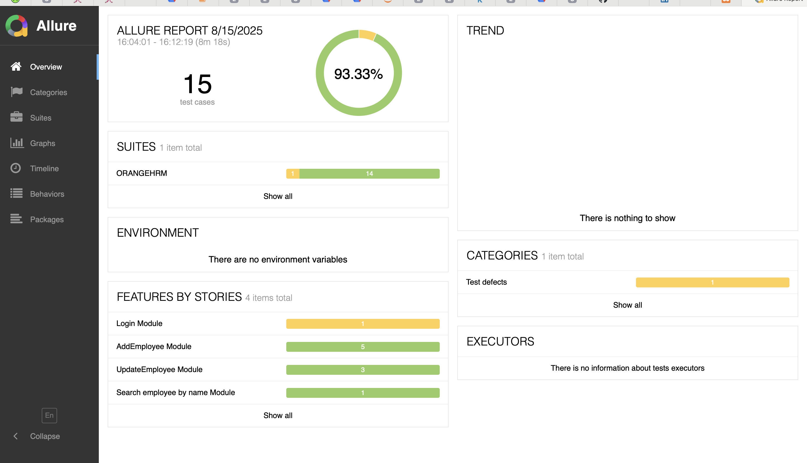

Perfect! Here’s a **more visual and professional README** for your OrangeHRM Test Automation suite, ready for GitHub. I’ve added badges, a table for test coverage, and placeholders for screenshots. You can replace the placeholder links with actual URLs/screenshots later.

---

# OrangeHRM Test Automation Suite


---

## Overview

This project is a **TestNG-based automated test suite** for the OrangeHRM application. It uses the **Page Object Model (POM)** design pattern, along with **data-driven testing via Excel**, **custom logging**, **retry mechanisms**, and **Allure reports** for detailed test results.

The suite covers major HRM functionalities including employee management, admin registration, login, and search operations.

---

## Features

* **Page Object Model (POM)** for maintainable code.
* **Data-driven testing** using Excel (`.xlsx`) files.
* **Custom TestNG Listeners** for logging, retries, and reporting.
* **Retry Analyzer** to automatically rerun failed tests.
* **Allure Reports** for rich, interactive test execution reports.
* **LoggerLoad** for detailed debug/info logging.
* **Screenshots** captured for failures.

---

## Test Coverage

| Module          | Test Scenarios                                                         |
| --------------- | ---------------------------------------------------------------------- |
| **Login**       | Login with valid and invalid credentials, login via Excel test data    |
| **Employee**    | Create Employee, Update Employee Details, Search Employee by Name      |
| **Admin**       | Register Employee as Admin                                             |
| **Data-driven** | Create Employee using Excel test data                                  |


---

## Prerequisites

* Java 23 or later
* Maven 4.x
* Chrome browser (compatible with Selenium WebDriver)
* IDE: Eclipse / IntelliJ IDEA (optional)

---

## Running Tests

1. **Clone the repository:**

```bash
git clone <repository-url>
cd OrangeHRMTestNG
```

2. **Run tests using Maven:**

```bash
mvn clean test
```

3. **Generate and view Allure Reports:**

```bash
mvn allure:serve
```

This will generate a detailed interactive report with logs, screenshots, and step details.

---

## Project Structure

```
OrangeHRMTestNG/
├── src/
│   ├── main/java/pageObjects/        # Page Object classes
│   └── test/java/pageTests/          # Test classes
│   └── test/resources/               # TestNG suite XMLs, Excel test data
├── logs/                             # Log files
├── screenshots/                      # Test failure screenshots
├── allure-results/                   # Allure report results
├── pom.xml                            # Maven dependencies & plugins
└── README.md                          # Project documentation
```

---

## Logging & Reporting

* **LoggerLoad** logs debug and info messages for every step.
* **Allure Reports** visualize test execution with stories, features, and steps.
* **Retry Analyzer** automatically reruns failed tests to reduce flakiness.
* Screenshots are automatically captured for failed steps.

---
### Allure report


---
### Login & Employee Management Flow
```mermaid

flowchart TD
A[Login Module] --> B[Create Employee]
B --> C[Register Employee as Admin]
C --> D[Login as New Employee]
D --> E[Update Employee Details]
E --> F[Search Employee by Name]
B --> H[Data-driven Create Employee Excel]
A --> I[Login via Excel Test Data]


